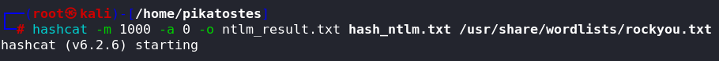

# Práctica 01: Proceso de Cracking de Contraseñas con Hashcat
## 1. Preparación del Diccionario - Modificar rockyou.txt
Vamos a añadir la palabra `hashcat` a `rockyou.txt`.
1. En Kali, `rockyou.txt` ya viene instalado
   
2. Siendo superusuario, escribimos el siguiente comando
   

## 2. Descifrado de Hashes con Hashcat
Hashcat es un potente descifrador de contraseñas que admite diferentes tipos de hash.
### 1. Descifrar Hash MD5
El hash a descifrar es el siguiente:
```sh
8743b52063cd84097a65d1633f5c74f5
```
1. Escribimos el siguiente comando:

2. Tras esperar un poco, se nos habrá generado el archivo con la contraseña crackeada:


### 2. Descifrar Hash NTLM




### 3. Descifrar Hash NETNTLMv2


